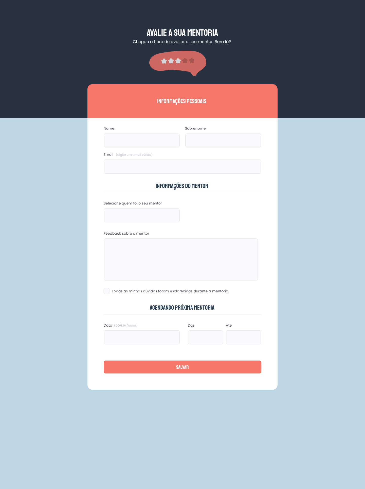

  

  

## 🖥️ Projeto
Esse é um projeto web de um modelo de formulário de cadastro para o feedback das seções de mentoria.

## 🚀 Tecnologias
Esse projeto foi desenvolvido durante o curos de Explore da Rocketsat com as seguintes tecnologias:

- HTML
- CSS
- GIT E GITHUB

## 🏷️layout
Você pode visualizar o layout do projeto através 
[desse link](https://www.figma.com/file/QRrYhov7ftwBAgWNhdTZx2/Stage-03---Formul%C3%A1rio-intermedi%C3%A1rio-(Copy)?type=design&node-id=0-1&t=PtoC7RX3tJIOHAuO-0).
É necessario ter uma conta no [Figma](https://www.figma.com).